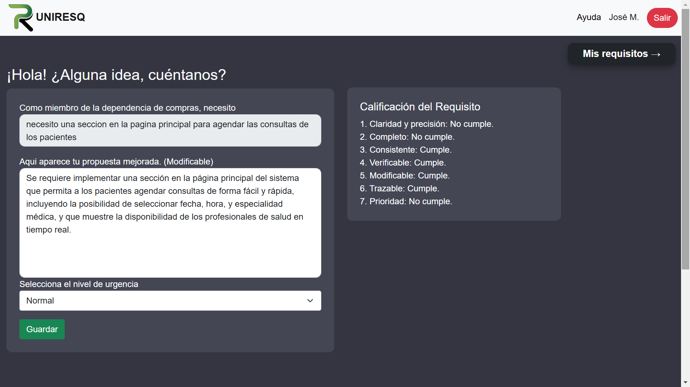
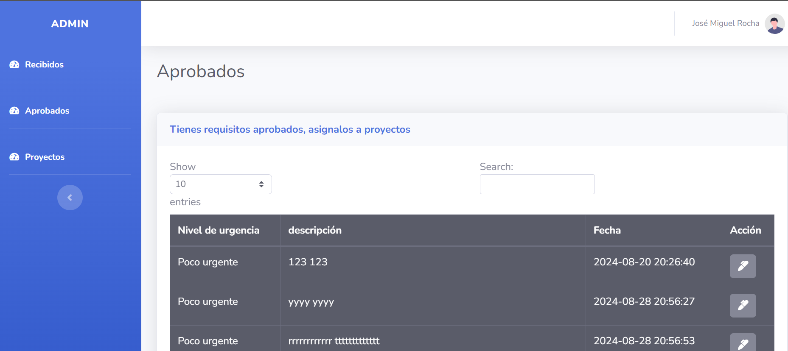
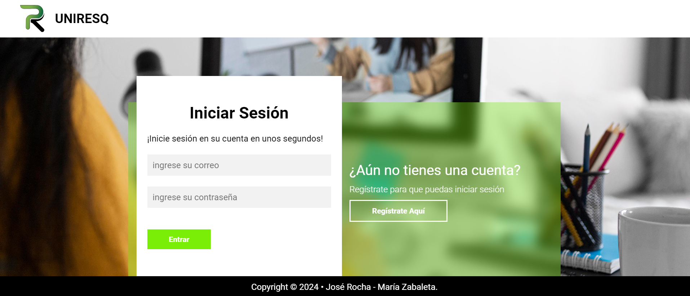
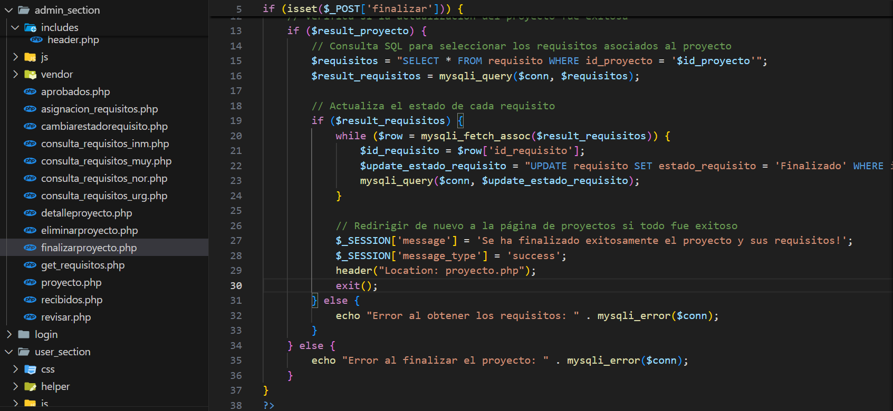
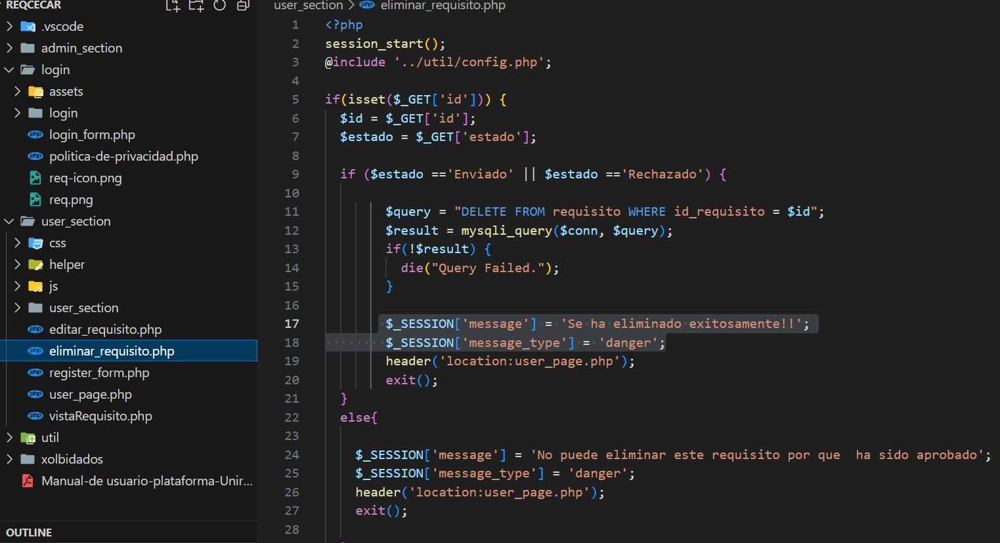
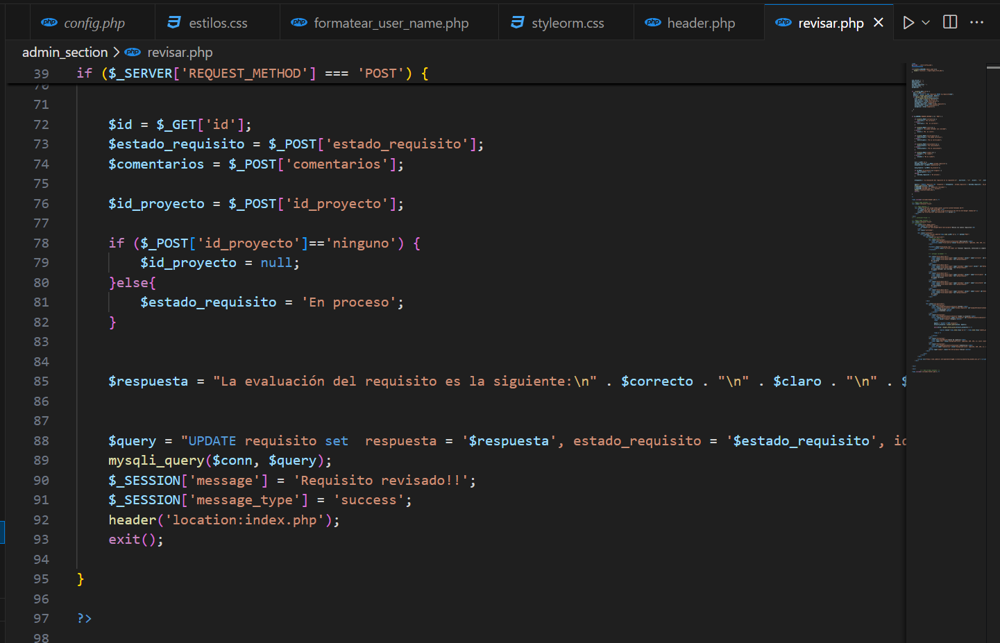

# 🧠 Plataforma para la Gestión de Requisitos de Software

Una plataforma pensada para **usuarios no técnicos** que desean identificar problemas en sus áreas de trabajo y transformarlos en **requisitos de software claros y estructurados**, con el apoyo de **Inteligencia Artificial**.

El objetivo principal es **acercar la tecnología a los equipos de negocio**, facilitando la detección de oportunidades de mejora y la comunicación efectiva con equipos de desarrollo.

---

## 🚀 Propósito del Proyecto

En muchas organizaciones, los problemas operativos y las oportunidades de mejora se quedan en ideas sueltas o conversaciones informales. Esta plataforma busca:

- Facilitar la **identificación de problemas reales** en el entorno laboral.
- Traducir esas necesidades en **requisitos de software bien definidos**.
- Reducir la brecha entre **usuarios de negocio y equipos técnicos**.
- Aprovechar la **IA** para guiar, estructurar y mejorar la calidad de los requisitos.

---

## 🏗️ Arquitectura General

La aplicación está dividida en **dos grandes roles**, además de los flujos de autenticación:

- **Cliente (Usuario no técnico)**
- **Administrador**
- **Registro y Login**

Cada sección está diseñada para ser intuitiva, clara y enfocada en la experiencia del usuario.

---

## 👤 Sección Cliente

Pensada para colaboradores de cualquier área (operaciones, ventas, logística, RRHH, etc.).

### Funcionalidades principales:

- Creación guiada de requisitos de software.
- Identificación de problemas y áreas de mejora.
- Asistencia con **Inteligencia Artificial** para:
  - Clarificar ideas.
  - Estructurar requisitos.
  - Detectar ambigüedades.
- Visualización del estado de sus solicitudes.
- Historial de requisitos creados.

📸 **Vista del Cliente**

---

## 🛠️ Sección Administrador

Diseñada para equipos técnicos, líderes de producto o responsables de sistemas.

### Funcionalidades principales:

- Gestión de requisitos enviados por los clientes.
- Revisión, validación y priorización de requisitos.
- Análisis de patrones y áreas recurrentes de mejora.
- Control de usuarios y permisos.
- Supervisión del uso de la plataforma.

📸 **Vista del Administrador**

---

## 🔐 Registro y Login

La plataforma cuenta con un sistema de autenticación seguro y sencillo.

### Características:

- Registro de nuevos usuarios.
- Inicio de sesión por roles (Cliente / Administrador).
- Validación de credenciales.
- Experiencia clara y accesible.

📸 **Login y Registro**

---

## 🤖 Inteligencia Artificial como Asistente

La IA juega un papel clave en el proyecto:

- Ayuda a los usuarios no técnicos a **expresar correctamente sus ideas**.
- Sugiere mejoras en la redacción de requisitos.
- Identifica posibles inconsistencias o información faltante.
- Facilita la estandarización de los requisitos.

Esto permite que los requisitos lleguen a los equipos técnicos de forma más clara y accionable.

---

## 🧰 Tecnologías Utilizadas

Este proyecto fue desarrollado utilizando un stack orientado a aplicaciones web tradicionales, combinado con servicios de Inteligencia Artificial:

- **PHP** – Lógica del servidor y procesamiento de datos.
- **MySQL** – Base de datos relacional.
- **HTML5** – Estructura de las vistas.
- **CSS3** – Estilos personalizados.
- **Bootstrap** – Diseño responsive y componentes UI.
- **API de OpenAI** – Asistencia con Inteligencia Artificial para la creación y mejora de requisitos.

---

## 🖼️ Proceso de Construcción

Durante el desarrollo del proyecto se documentaron distintas etapas del proceso:

- Diseño inicial.
- Construcción de interfaces.
- Integración de IA.
- Pruebas y validaciones.

📸 **Imágenes del proceso de construcción**

---

## 🎯 Beneficios Clave

- ✔️ Reduce errores en la definición de requisitos.
- ✔️ Ahorra tiempo a equipos técnicos.
- ✔️ Empodera a usuarios no técnicos.
- ✔️ Mejora la comunicación entre áreas.
- ✔️ Facilita la transformación digital.

---

## 📄 Licencia

Este proyecto se distribuye bajo la licencia correspondiente definida por el autor.

---

✨ *Este proyecto nace con la idea de que cualquier persona, sin importar su perfil técnico, pueda ser parte activa en la creación de soluciones de software.*

